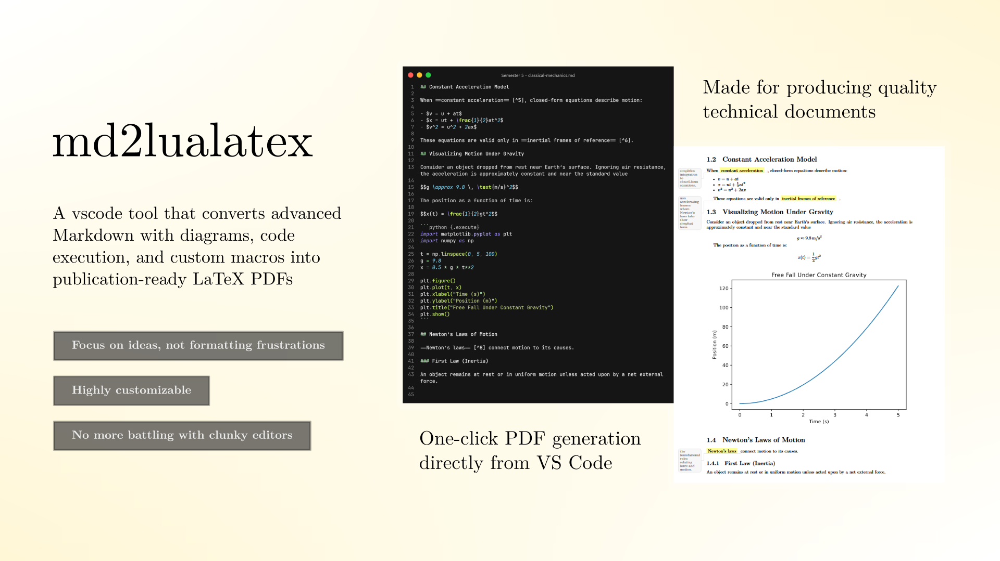
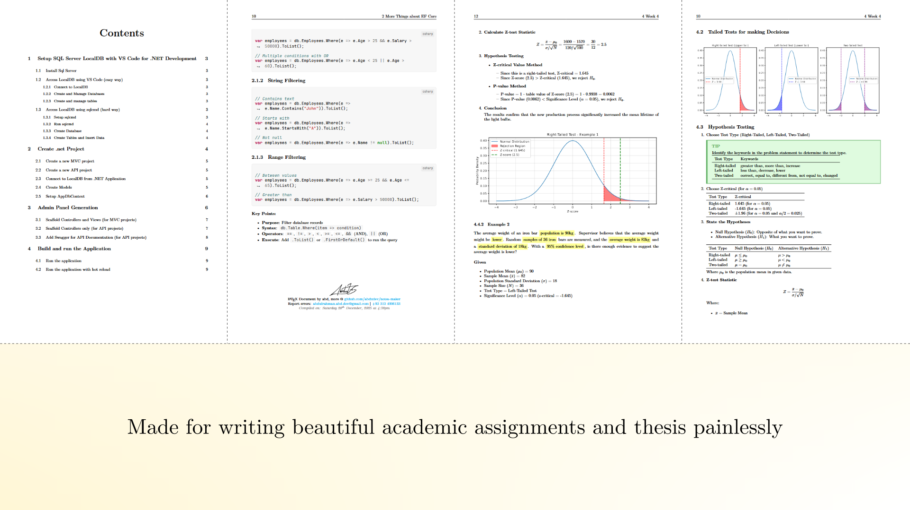

Windows | [Linux](README-LINUX.md)

# Markdown Latex PDF Builder



A vscode tool that converts advanced Markdown with diagrams, code execution, and custom macros into publication-ready LaTeX PDFs.



## Table of Contents

- [Prerequisites](#prerequisites)
- [Installation](#installation)
- [VS Code Setup](#vs-code-setup)
- [Usage](#usage)
- [Changing Default Values](#changing-default-values)
- [Changing the University Logo](#changing-the-university-logo)
- [Updating markdown-latex-pdf-builder](#updating-markdown-latex-pdf-builder)
- [Uninstallation](#uninstallation)
- [Tested Environments](#tested-environments)

## Prerequisites

Before starting, make sure you have the following:

### Python

Download and install it from [python.org](https://www.python.org/downloads/). Preferably, above version 3.10.

Check installation:

```powershell
python --version; python -m pip --version
```

### Visual Studio Code

Download from [code.visualstudio.com](https://code.visualstudio.com/download).

Check installation:

```powershell
code --version
```

Install the [Command Runner](https://marketplace.visualstudio.com/items?itemName=edonet.vscode-command-runner) extension for VS Code.

### Node Package Manager (optional, for Mermaid diagrams)

Download and install Node.js from [nodejs.org](https://nodejs.org/en/download).

Check installation:

```powershell
node --version; npm --version
```

> [!NOTE]
> If you're having trouble running `npm --version`, you may need to change the execution policy. Run this command:
>
> ```powershell
> Set-ExecutionPolicy -Scope CurrentUser -ExecutionPolicy RemoteSigned
> ```

## Installation

Open PowerShell (Terminal on Windows 11) and run these commands:

> [!CAUTION]
> Do not run as Administrator

#### Step 1: Download and install TinyTeX

Install TinyTeX to your user AppData folder:

```powershell
wget "https://github.com/rstudio/tinytex-releases/releases/download/daily/TinyTeX-1.zip" -OutFile "$env:TEMP\TinyTeX.zip"
Expand-Archive -Force -Path "$env:TEMP\TinyTeX.zip" -DestinationPath $env:APPDATA
Remove-Item "$env:TEMP\TinyTeX.zip"
$env:PATH += ";$env:APPDATA\TinyTeX\bin\windows"
tlmgr path add
tlmgr option repository ctan
tlmgr postaction install script xetex

```

#### Step 2: Install LaTeX packages

Install required LaTeX packages using `tlmgr`:

```powershell
tlmgr update --self
tlmgr install adjustbox csvsimple datetime emoji endnotes fancyhdr fmtcount footmisc grfext hyphenat lineno listings lua-ul markdown minted paralist pdfcol soul tcolorbox tikzfill titlesec titling tocloft todonotes ulem upquote

```

> [!NOTE]
>
> 1. If you encounter "The term 'tlmgr' is not recognized" errors, try running the following command to get the correct path:
>
>    ```powershell
>    "$env:APPDATA\TinyTeX\bin\windows\"
>    ```
>
> 2. Then manually add the output path to your system PATH variable.

#### Step 3: Install Pygments

Install the Pygments syntax highlighter for code blocks:

```powershell
python -m pip install Pygments
```

#### Step 4: Download markdown-latex-pdf-builder

Download markdown-latex-pdf-builder to your user AppData folder:

```powershell
wget https://github.com/abdxdev/markdown-latex-pdf-builder/archive/refs/heads/main.zip -OutFile "$env:TEMP\main.zip"
Expand-Archive -Force -Path "$env:TEMP\main.zip" -DestinationPath "$env:APPDATA\markdown-latex-pdf-builder"
Remove-Item "$env:TEMP\main.zip"
Copy-Item "$env:APPDATA\markdown-latex-pdf-builder\markdown-latex-pdf-builder-main\default.json" "$env:APPDATA\markdown-latex-pdf-builder\default.json"

```

#### Step 5 (Optional): Install Mermaid CLI for diagram support

Install Mermaid CLI globally using npm:

```powershell
npm install -g @mermaid-js/mermaid-cli
```

#### Step 6 (Optional): Install Python dependencies

Install required Python packages for plotting inside python execution blocks:

```powershell
python -m pip install numpy matplotlib
```

#### Step 7: Verify installation

Run this command to test markdown-latex-pdf-builder with the comprehensive guide example. If everything is set up correctly, a PDF document should be generated and opened automatically.

```powershell
python "$env:APPDATA\markdown-latex-pdf-builder\markdown-latex-pdf-builder-main\script.py" "$env:APPDATA\markdown-latex-pdf-builder\markdown-latex-pdf-builder-main\test\COMPREHENSIVE-GUIDE.md" --show
```

## VS Code Setup

1. Open VS Code and press `Ctrl + Shift + P`.
2. Search for **Preferences: Open User Settings (JSON)** and open it.
3. Add this to the bottom of your `settings.json` file just before the closing `}`:

   ```jsonc
   // ...other settings...,
    "command-runner.commands": {
        "markdown-latex-pdf-builder: Build Document (follow json settings)": "python \"$env:APPDATA\\markdown-latex-pdf-builder\\markdown-latex-pdf-builder-main\\script.py\" \"${file}\"",
        "markdown-latex-pdf-builder: Build Assignment (add university title page)": "python \"$env:APPDATA\\markdown-latex-pdf-builder\\markdown-latex-pdf-builder-main\\script.py\" \"${file}\" --titleTemplate university-title --enableContentPage false",
        "markdown-latex-pdf-builder: Build Notes (add title)": "python \"$env:APPDATA\\markdown-latex-pdf-builder\\markdown-latex-pdf-builder-main\\script.py\" \"${file}\" --titleTemplate header-title --enableContentPage false",
        "markdown-latex-pdf-builder: Build Publication (add contents and title page)": "python \"$env:APPDATA\\markdown-latex-pdf-builder\\markdown-latex-pdf-builder-main\\script.py\" \"${file}\" --titleTemplate separate-page-title --enableContentPage true"
    }
   ```

4. Save the file.

## Usage

1. Open any folder in VS Code.
2. Create a new Markdown file (for example, `report.md`).
3. Add your content. Check out our [comprehensive guide](https://github.com/abdxdev/markdown-latex-pdf-builder/blob/main/test/COMPREHENSIVE-GUIDE.pdf) for advanced features and examples.
4. Press `Ctrl + Shift + R` and select **markdown-latex-pdf-builder: Build Document**. (Extension: Command Runner must be installed. Follow prerequisites if you haven't done so.)
5. After a few moments, the PDF will be generated along with a `.json` metadata file. Edit this file to change document settings like title, university, and date. (To permanently change default values, see the next section.)
6. Re-run the build command from step 4 to generate the updated PDF.

> [!NOTE]
> You may delete the build folder (`_build_report` in this case) after the PDF is finalized.

## Changing Default Values

You can edit the default settings for document generation by modifying the `default.json` file.

Run this command to open it in VS Code:

```powershell
code "$env:APPDATA\markdown-latex-pdf-builder\default.json"
```

The next time you generate a document, it will use the updated defaults.

## Changing the University Logo

To replace the default logo, open the script directory:

```powershell
explorer $env:APPDATA\markdown-latex-pdf-builder\markdown-latex-pdf-builder-main\
```

Replace the existing `uni-logo.pdf` file with your logo file (use the same name).

## Updating markdown-latex-pdf-builder

To update markdown-latex-pdf-builder, run these commands in PowerShell:

#### Step 1: Remove old version and download the latest

```powershell
Remove-Item "$env:APPDATA\markdown-latex-pdf-builder\markdown-latex-pdf-builder-main" -Recurse -Force
wget https://github.com/abdxdev/markdown-latex-pdf-builder/archive/refs/heads/main.zip -OutFile "$env:TEMP\main.zip"
Expand-Archive -Path "$env:TEMP\main.zip" -DestinationPath "$env:APPDATA\markdown-latex-pdf-builder"
Remove-Item "$env:TEMP\main.zip"

```

#### Step 2: Reinstall LaTeX packages

Install latex packages from [step 2](#step-2-install-latex-packages) of the installation section.

## Uninstallation

#### Step 1: Remove TinyTeX

```powershell
tlmgr path remove
Remove-Item "$env:APPDATA\TinyTeX" -Recurse -Force

```

> [!NOTE]
> Microsoft Edge may lock certain files related to the uninstallation process if it is running in the background.  
> To avoid issues, open Task Manager, locate "Microsoft Edge" under the "Processes" tab, and select "End Task" before proceeding.

#### Step 2: Remove markdown-latex-pdf-builder

```powershell
Remove-Item "$env:APPDATA\markdown-latex-pdf-builder" -Recurse -Force
```

## Tested Environments

This tool was tested on:

- Windows 11.
- Command runner v0.0.124
- Python 3.13.3
- TinyTeX 0.57
- tlmgr 76773
