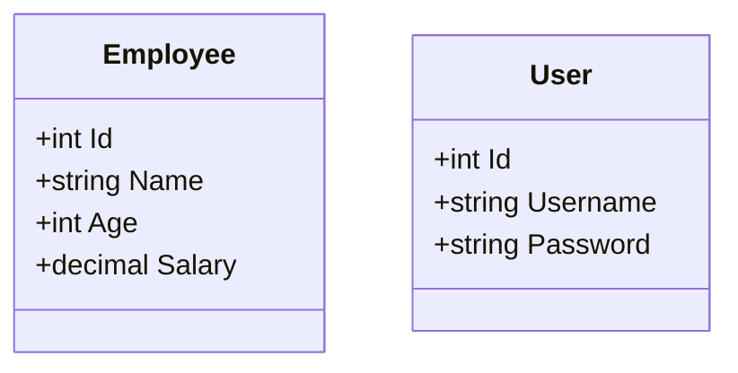

\title{EAD Notes}

# Question

- Create an employee management system using ASP.NET MVC.
- Use Entity Framework for database operations.
- Utilize sessions for user authentication and state management.
- Implement the following functionalities:

#### Login/Logout

1. Login: A simple login page to authenticate users before accessing the employee management system.
2. Logout: A logout functionality that ends the user session and redirects to the login page.
3. It should redirect to the login page if the user is not authenticated.
4. It should redirect to the employee list page after successful login.

#### Crud Operations

1. Add Employee: A form to input employee details and save them to a database.
2. View Employees: A page to display a list of all employees with options to edit or delete each entry.
3. Edit Employee: A form to update existing employee details.
4. Delete Employee: An option to remove an employee from the database.

#### Database Model



## Program Settings

#### Program.cs

::: note
Not Important to remember for exam
:::

```csharp
// ...
builder.Services.AddSession();
// ...
app.UseSession();
app.Run();
// ...
```

## Models

#### Models/User.cs

::: note
Just remember to create User class
:::

```csharp
using System.ComponentModel.DataAnnotations;

namespace ProjectName.Models
{
    public class User
    {
        public int Id { get; set; }
        public string? Username { get; set; }
        public string? Password { get; set; }
    }
}
```

#### Models/Employee.cs

::: note
Just remember to create Employee class
:::

```csharp
using System.ComponentModel.DataAnnotations;

namespace ProjectName.Models
{
    public class Employee
    {
        public int Id { get; set; }
        public string? Name { get; set; }
        public int? Age { get; set; }
        public decimal? Salary { get; set; }
    }
}
```

#### Models/ApplicationDbContext.cs

::: note
Not Important to remember for exam
:::

```csharp
using Microsoft.EntityFrameworkCore;
using ProjectName.Models;

namespace ProjectName
{
    public class ApplicationDbContext : DbContext
    {
        public DbSet<User> Users { get; set; }
        public DbSet<Employee> Employees { get; set; }

        protected override void OnConfiguring(DbContextOptionsBuilder optionsBuilder)
        {
            optionsBuilder.UseSqlServer("YourConnectionStringHere");
        }
    }
}
```

## Login

::: tip

- Match the parameter names in the form with those in the controller action methods.
- Match `asp-controller` and `asp-action` attributes in the form with the controller and action method names.

:::

#### Controllers/LoginController.cs

::: tip

Only need to remember `IActionResult` methods, not the whole class and namespace structure for exam.

:::

```csharp
using Microsoft.AspNetCore.Mvc;
using ProjectName.Models;
namespace ProjectName.Controllers
{
    public class LoginController : Controller
    {
        // Checking session for authentication if user is already logged in, redirect to Dashboard, else show login view
        [HttpGet]
        public IActionResult Index()
        {
            if (HttpContext.Session.GetString("Username") != null)
            {
                return RedirectToAction("Index", "Dashboard");
            }
            return View();
        }

        // Handling login post request
        [HttpPost]
        public IActionResult Index(string u, string p)
        {
            using (var db = new ApplicationDbContext())
            {
                var user = db.Users.FirstOrDefault(x => x.Username == u && x.Password == p);
                if (user != null)
                {
                    HttpContext.Session.SetString("Username", user.Username);
                    return RedirectToAction("Index", "Dashboard");
                }
            }
            ViewBag.Error = "Invalid credentials";
            return View();
        }
    }
}
```

#### Views/Login/Index.cshtml

::: tip

- Remember to create a form with `asp-controller` and `asp-action` attributes matching the controller and action method names.
- Match `name` attributes in input fields with parameter names in the controller action method.
- You can ignore the `ViewBag.Error` part for exam if not asked specifically

:::

```html
<form asp-controller="Login" asp-action="Index" method="post">
  <label>Enter Username</label>
  <input name="u" type="text" />

  <label>Enter Password</label>
  <input name="p" type="password" />

  <button type="submit">Login</button>
</form>

@ViewBag.Error
```

## Dashboard

#### Controllers/DashboardController.cs

::: tip

- Only need to remember `IActionResult` methods, not the whole class and namespace structure for exam.
- Use `using (var db = new ApplicationDbContext()) { ... }` for database operations.
- See how `db.Employees.Add(emp);` is used to add a new employee.
- See how `db.Employees.Update(emp);` is used to update an existing employee
- Remember the use of `HttpContext.Session` for session management.
  - `HttpContext.Session.GetString("Username")` to check if user is logged in.
  - `HttpContext.Session.Clear()` to logout user.
- See how `db.Employees.Find(id);` is used to retrieve a specific employee by ID.
- See how `db.Employees.Remove(emp);` is used to delete an employee.

:::

::: note

- Note that there are two methods with the same name `AddEmployee` and `EditEmployee` each, one for GET request and another for POST request.
- `[HttpGet]` attribute is used for methods that display forms. For example, displaying the Add Employee or Edit Employee form.
- `[HttpPost]` attribute is used for methods that handle form submissions. For example, processing the data submitted from the Add Employee or Edit Employee form.

:::

```csharp
using Microsoft.AspNetCore.Mvc;
namespace ProjectName.Controllers
{
    public class DashboardController : Controller
    {
        // Checking session for authentication, if not logged in redirect to Login page, else show employee list
        public IActionResult Index()
        {
            if (HttpContext.Session.GetString("Username") == null)
            {
                return RedirectToAction("Index", "Login");
            }

            List<Employee> empList = new List<Employee>();
            using (var db = new ApplicationDbContext())
            {
                empList = db.Employees.ToList();
            }
            return View(empList);
        }

        // Logout action to clear session and redirect to Login page
        public IActionResult Logout()
        {
            HttpContext.Session.Clear();
            return RedirectToAction("Index", "Login");
        }

        // ------- Add Employee section ------

        // Add Employee form for `Views/Dashboard/Index.cshtml`
        [HttpGet]
        public IActionResult AddEmployee()
        {
            // Displaying Add Employee form
            return View();
        }

        // Add Employee post action for `Views/Dashboard/AddEmployee.cshtml`
        [HttpPost]
        public IActionResult AddEmployee(string n, string a, string s)
        {
            using (var db = new ApplicationDbContext())
            {
                Employee emp = new Employee { Name = n, Age = Convert.ToInt32(a), Salary = Convert.ToDecimal(s) };
                db.Employees.Add(emp);
                db.SaveChanges();
                // Redirecting to dashboard after adding new employee
                return RedirectToAction("Index");
            }
        }

        // ------- Edit Employee section ------

        // Edit Employee form for `Views/Dashboard/Index.cshtml`
        [HttpGet]
        public IActionResult EditEmployee(string id)
        {
            using (var db = new ApplicationDbContext())
            {
                Employee emp = db.Employees.Find(Convert.ToInt32(id));
                // Displaying Edit Employee form with existing data
                return View(emp);
            }
        }

        // Edit Employee post action for `Views/Dashboard/EditEmployee.cshtml`
        [HttpPost]
        public IActionResult EditEmployee(string id, string n, string a, string s)
        {
            Employee emp = new Employee
            {
                Id = int.Parse(id),
                Name = n,
                Age = int.Parse(a),
                Salary = decimal.Parse(s)
            };

            using (var db = new ApplicationDbContext())
            {
                db.Employees.Update(emp);
                db.SaveChanges();
            }
            // Redirecting to dashboard after updating employee
            return RedirectToAction("Index");
        }

        // ------- Delete Employee section ------

        // Delete Employee action for `Views/Dashboard/Index.cshtml`
        public IActionResult DeleteEmployee(string id)
        {
            using (var db = new ApplicationDbContext())
            {
                Employee emp = db.Employees.Find(Convert.ToInt32(id));
                db.Employees.Remove(emp);
                db.SaveChanges();
            }
            // Redirecting to dashboard after deleting employee
            return RedirectToAction("Index");
        }
    }
}

```

#### Views/Dashboard/Index.cshtml

::: tip

- See how using `@foreach` to loop through the `Model` to display employee details in a table.
- Remember how `href` links are constructed for Edit and Delete actions in the table.
- Remember the use of `asp-controller` and `asp-action` for navigation links in `<a>` tags.

:::

```html
<table>
  <thead>
    <tr>
      <th>Name</th>
      <th>Age</th>
      <th>Salary</th>
      <th>Actions</th>
    </tr>
  </thead>
  <tbody>
    @foreach (var emp in Model) {
    <tr>
      <td>@emp.Name</td>
      <td>@emp.Age</td>
      <td>@emp.Salary</td>
      <td><a href="/Dashboard/EditEmployee?id=@emp.Id">Edit</a></td>
      <td><a href="/Dashboard/DeleteEmployee?id=@emp.Id">Delete</a></td>
    </tr>
    }
  </tbody>
</table>
<a asp-controller="Dashboard" asp-action="AddEmployee">Add New Employee</a>
<a asp-controller="Dashboard" asp-action="Logout">Logout</a>
```

#### Views/Dashboard/AddEmployee.cshtml

```html
<form asp-controller="Dashboard" asp-action="AddEmployee" method="post">
  <label>Name</label>
  <input name="n" type="text" />

  <label>Age</label>
  <input name="a" type="number" />

  <label>Salary</label>
  <input name="s" type="number" step="0.01" />

  <button type="submit">Add Employee</button>
</form>
<a asp-controller="Dashboard" asp-action="Index">Back to Employee List</a>
```

#### Views/Dashboard/EditEmployee.cshtml

```html
<form asp-controller="Dashboard" asp-action="EditEmployee" method="post">
  <input type="hidden" name="id" value="@Model.Id" />
  <label>Name</label>
  <input name="n" type="text" value="@Model.Name" />

  <label>Age</label>
  <input name="a" type="number" value="@Model.Age" />

  <label>Salary</label>
  <input name="s" type="number" step="0.01" value="@Model.Salary" />

  <button type="submit">Update Employee</button>
</form>
<a asp-controller="Dashboard" asp-action="Index">Back to Employee List</a>
```

# More Things about EF Core

::: tip

Just go through these for better understanding of EF Core CRUD operations, you could be asked about them in exam

:::

| Action | EF Core Method                              | SQL Equivalent |
| ------ | ------------------------------------------- | -------------- |
| Create | `.Add()` + `.SaveChanges()`                 | `INSERT INTO`  |
| Read   | `.Find()`, `.ToList()`, `.FirstOrDefault()` | `SELECT`       |
| Update | `.Update()` + `.SaveChanges()`              | `UPDATE`       |
| Delete | `.Remove()` + `.SaveChanges()`              | `DELETE FROM`  |

## Filtering with Where()

::: tip

Use `Where()` to filter records based on conditions. Similar to SQL `WHERE` clause.

:::

### Basic Filtering

```csharp
// Filter by age
var employees = db.Employees.Where(e => e.Age > 25).ToList();

// Find by name
var employee = db.Employees.Where(e => e.Name == "John").FirstOrDefault();

// Multiple conditions with AND
var employees = db.Employees.Where(e => e.Age > 25 && e.Salary > 50000).ToList();

// Multiple conditions with OR
var employees = db.Employees.Where(e => e.Age < 25 || e.Age > 60).ToList();
```

### String Filtering

```csharp
// Contains text
var employees = db.Employees.Where(e => e.Name.Contains("John")).ToList();

// Starts with
var employees = db.Employees.Where(e => e.Name.StartsWith("A")).ToList();

// Not null
var employees = db.Employees.Where(e => e.Name != null).ToList();
```

### Range Filtering

```csharp
// Between values
var employees = db.Employees.Where(e => e.Age >= 25 && e.Age <= 65).ToList();

// Greater than
var employees = db.Employees.Where(e => e.Salary > 50000).ToList();
```

#### Key Points:

- **Purpose**: Filter database records
- **Syntax**: `db.Table.Where(item => condition)`
- **Operators**: `==`, `!=`, `>`, `<`, `>=`, `<=`, `&&` (AND), `||` (OR)
- **Execute**: Add `.ToList()` or `.FirstOrDefault()` to run the query
