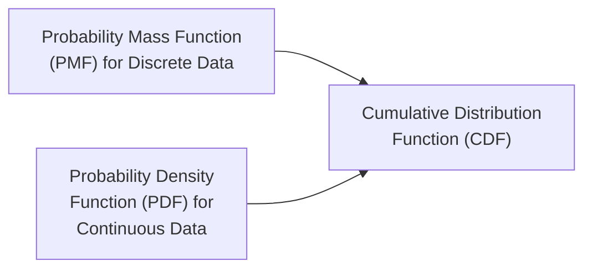
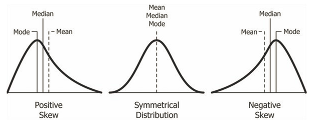

- [x] Week 1 (only formulas)
- [x] Week 2 (only formulas)
- [x] Week 3 (only formulas)
- [x] Week 4 (theory + solved examples)
- [x] Week 5 (formulas with steps)
- [ ] Week 6
- [ ] Week 7
- [ ] Week 8

---

# Week 0

...

# Week 1 and Week 2

> [!WARNING]
> These formulas are written to be remembered after studying the slides

## Mean

$$
\text{Mean} = \frac{\sum X_i}{N}
$$

Where:

- $X_i$ = each value
- $N$ = number of values

## Median

Sort the data in ascending order.

### If N is odd

$$
\text{Median} = \text{Value at position } \left(\frac{N + 1}{2}\right)
$$

### If N is even

$$
\text{Median} = \frac{\text{Value at position} \left(\frac{N}{2}\right) + \text{Value at position} \left(\frac{N}{2} + 1\right)}{2}
$$

## Mode

1. Identify the value(s) that occur most frequently.
2. If no value repeats, the dataset is said to have no mode.

## Range

$$
\text{Range} = \text{Max} - \text{Min}
$$

## Variance

- $X_i$ = each value
- $\bar{X}$ = mean of the values
- $N$ = number of values

### Population Variance

$$
\sigma^2 = \frac{\text{sum of squared deviations from the mean}}{N} = \frac{\sum (X_i - \bar{X})^2}{N}
$$

### Sample Variance

$$
s^2 = \frac{\text{sum of squared deviations from the mean}}{N - 1} = \frac{\sum (X_i - \bar{X})^2}{N - 1}
$$

## Standard Deviation

> [!TIP]
>
> Remember: S for Standard Deviation, S for Squareroot. So the standard deviation is the squareroot of the variance and not the other way around. (I always mess this up)

### Population Standard Deviation

$$
\sigma = \sqrt{\sigma^2} \quad
$$

### Sample Standard Deviation

$$
s = \sqrt{s^2} \quad
$$

## Covariance

- $X_i$ = each value of variable X
- $Y_i$ = each value of variable Y
- $\bar{X}$ = mean of variable X
- $\bar{Y}$ = mean of variable Y
- $N$ = number of values

### Population Covariance

$$
\text{Cov}(X, Y) = \frac{\sum (X_i - \bar{X})(Y_i - \bar{Y})}{N}
$$

### Sample Covariance

$$
\text{Cov}(X, Y) = \frac{\sum (X_i - \bar{X})(Y_i - \bar{Y})}{N - 1}
$$

## Correlation

- $X_i$ = each value of variable X
- $Y_i$ = each value of variable Y
- $\bar{X}$ = mean of variable X
- $\bar{Y}$ = mean of variable Y
- $N$ = number of values

### Population Correlation Coefficient

$$
r = \frac{\text{Cov}(X, Y)}{\sigma_X \sigma_Y}
$$

Where:

- $\sigma_X = \sqrt{\frac{\sum (X_i - \bar{X})^2}{N}}$
- $\sigma_Y = \sqrt{\frac{\sum (Y_i - \bar{Y})^2}{N}}$

### Sample Correlation Coefficient

$$
r = \frac{\text{Cov}(X, Y)}{s_X s_Y}
$$

Where:

- $s_X = \sqrt{\frac{\sum (X_i - \bar{X})^2}{N - 1}}$
- $s_Y = \sqrt{\frac{\sum (Y_i - \bar{Y})^2}{N - 1}}$

# Week 3

> [!WARNING]
> These formulas are written to be remembered after studying the slides

## Probability

$$
P(A) = \frac{\text{Number of favorable outcomes}}{\text{Total number of outcomes}}
$$

Where:

- $P(A)$ = Probability of event A

### Addition Rule

#### Mutually Exclusive Events

$$
P(A \cup B) = P(A) + P(B)
$$

#### Non-Mutually Exclusive Events

$$
P(A \cup B) = P(A) + P(B) - P(A \cap B)
$$

### Multiplication Rule

#### Independent Events

$$
P(A \cap B) = P(A) \times P(B)
$$

#### Dependent Events

$$
P(A \cap B) = P(A) \times P(B|A)
$$

Where:

- $P(B|A)$ is the conditional probability of B given A.
- $P(B|A) = \frac{P(A \cap B)}{P(A)}$

> [!NOTE]
>
> - A deck of cards has 52 cards.
> - 4 suits: Hearts, Diamonds, Clubs, Spades.
> - Each suit has 13 cards: Ace, 2-10, Jack, Queen, King.
> - Probability of drawing an Ace: $P(Ace) = \frac{4}{52} = \frac{1}{13}$

## Empirical Rule (68-95-99.7 Rule)

- About 68% of data falls within 1 standard deviation of the mean ($\mu \pm \sigma$).
- About 95% of data falls within 2 standard deviations of the mean ($\mu \pm 2\sigma$).
- About 99.7% of data falls within 3 standard deviations of the mean ($\mu \pm 3\sigma$).


## Probability Distribution Functions

> [!TIP]
>
> - This topic is confusing watch the video
> - [Probability Distribution Functions (PMF, PDF, CDF) - YouTube](https://www.youtube.com/watch?v=YXLVjCKVP7U)



> [!NOTE]
>
> - PDFs means Probability Distribution Functions
> - PDF means Probability Density Function which is a type of Probability Distribution Function

## PDF of Normal Distribution

$$
f(x) = \frac{1}{\sigma \sqrt{2\pi}} e^{-\frac{(x - \mu)^2}{2\sigma^2}}
$$

Where:

- $\mu$ = Mean (average)
- $\sigma^2$ = Variance
- $\sigma$ = Standard deviation (data spread)
- $\pi$ = Pi $\approx 3.14159$ ([[SHIFT] + [x10]] on your calculator)
- $e$ = Euler's number $\approx 2.71828$ ([[ALPHA] + [x10]] on your calculator)

## Skewness



- **Positive Skewness**: Tail on the right side (mean > median > mode)
- **Zero Skewness**: Symmetrical distribution (mean = median = mode)
- **Negative Skewness**: Tail on the left side (mean < median < mode)

## PDF of Z - Distribution (standard normal distribution)

- Mean ($\mu$) = 0
- Standard Deviation ($\sigma$) = 1

$$
f(z) = \frac{1}{\sqrt{2\pi}} e^{-\frac{z^2}{2}}
$$

Where:

- $z$ = Z-score
- $\pi$ = Pi $\approx 3.14159$ ([[SHIFT] + [x10]] on your calculator)
- $e$ = Euler's number $\approx 2.71828$ ([[ALPHA] + [x10]] on your calculator)

## Z - Score

$$
Z = \frac{X - \mu}{\sigma}
$$

Where:

- $X$ = value from the dataset
- $\mu$ = mean of the dataset
- $\sigma$ = standard deviation of the dataset

> [!NOTE]
>
> - Finding a value from **formula**: $f(z) = \frac{1}{\sqrt{2\pi}} e^{-\frac{z^2}{2}}$ for a given Z-score **IS NOT SAME AS** Finding a value from **Z-table** for a given Z-score
> - Formula $f(z) = \frac{1}{\sqrt{2\pi}} e^{-\frac{z^2}{2}}$ gives PDF value for that Z-score.
> - Z-table gives CDF from the left up to that Z-score.

# Week 4

## Types of Hypothesis Tests

One sample test
: Test hypothesis about single population parameter.

Two sample test
: Compare 2 groups or samples.

Paired sample test
: Compare two related samples.

Tests for Proportions
: Test hypotheses about population proportions.

Chi-Square Tests
: Test for independence or goodness-of-fit.

## Tailed Tests for making Decisions

```python {.execute}
import numpy as np
import scipy.stats as stats
import matplotlib.pyplot as plt

# Set the significance level (alpha)
alpha = 0.05

# Generate the standard normal distribution
x = np.linspace(-4, 4, 1000)
y = stats.norm.pdf(x, 0, 1)

# Calculate critical values
z_critical_right = stats.norm.ppf(1 - alpha)  # Right-tailed test

# Plot Right-Tailed Test
plt.figure(figsize=(12, 5))
plt.subplot(1, 3, 1)
plt.plot(x, y, label="Normal Distribution")
plt.fill_between(x, y, where=(x >= z_critical_right), color='red', alpha=0.5)
plt.axvline(z_critical_right, color='r', linestyle='--', label=f'Z = {z_critical_right:.2f}')
plt.title("Right-Tailed Test (Upper Tail)")
plt.legend()

# Plot Left-Tailed Test
z_critical_left = stats.norm.ppf(alpha)  # Left-tailed test

plt.subplot(1, 3, 2)
plt.plot(x, y, label="Normal Distribution")
plt.fill_between(x, y, where=(x <= z_critical_left), color='blue', alpha=0.5)
plt.axvline(z_critical_left, color='b', linestyle='--', label=f'Z = {z_critical_left:.2f}')
plt.title("Left-Tailed Test (Lower Tail)")
plt.legend()

# Plot Two-Tailed Test
z_critical_two = stats.norm.ppf(1 - alpha / 2)  # Two-tailed test

plt.subplot(1, 3, 3)
plt.plot(x, y, label="Normal Distribution")
plt.fill_between(x, y, where=(x >= z_critical_two) | (x <= -z_critical_two), color='purple', alpha=0.5)
plt.axvline(z_critical_two, color='purple', linestyle='--', label=f'Z = ±{z_critical_two:.2f}')
plt.axvline(-z_critical_two, color='purple', linestyle='--')
plt.title("Two-Tailed Test")
plt.legend()

plt.tight_layout()
plt.show()
```

## Hypothesis Testing

1. Choose Test Type (Right-Tailed, Left-Tailed, Two-Tailed)

   > [!TIP]
   >
   > Identify the keywords in the problem statement to determine the test type.
   >
   > | Test Type    | Keywords                                                 |
   > | ------------ | -------------------------------------------------------- |
   > | Right-tailed | greater than, more than, increase                        |
   > | Left-tailed  | less than, decrease, lower                               |
   > | Two-tailed   | correct, equal to, different from, not equal to, changed |

2. Choose Z-critical (for $\alpha = 0.05$)

   | Test Type    | Z-critical                                         |
   | ------------ | -------------------------------------------------- |
   | Right-tailed | 1.645 (for $\alpha = 0.05$)                        |
   | Left-tailed  | -1.645 (for $\alpha = 0.05$)                       |
   | Two-tailed   | ±1.96 (for $\alpha = 0.05$ and $\alpha/2 = 0.025$) |

3. **State the Hypotheses**

   - Null Hypothesis ($H_0$): Opposite of what you want to prove.
   - Alternative Hypothesis ($H_1$): What you want to prove.

   | Test Type    | Null Hypothesis ($H_0$) | Alternative Hypothesis ($H_1$) |
   | ------------ | ----------------------- | ------------------------------ |
   | Right-tailed | $\mu \leq \mu_0$        | $\mu > \mu_0$                  |
   | Left-tailed  | $\mu \geq \mu_0$        | $\mu < \mu_0$                  |
   | Two-tailed   | $\mu = \mu_0$           | $\mu \neq \mu_0$               |

   Where $\mu_0$ is the population mean in given data.

4. **Z-test Statistic**

   $$
   Z = \frac{\bar{x} - \mu_0}{\sigma / \sqrt{N}}
   $$

   Where:

   - $\bar{x}$ = Sample Mean
   - $\mu_0$ = Population Mean (under null hypothesis)
   - $\sigma$ = Population Standard Deviation
   - $N$ = Sample Size

5. **Hypothesis Testing**

   - Z-Critical Value Method

     | Test Type    | Critical Value Method                              |
     | ------------ | -------------------------------------------------- |
     | Right-tailed | Reject $H_0$ if Z-score $>$ Z-critical             |
     | Left-tailed  | Reject $H_0$ if Z-score $<$ -Z-critical            |
     | Two-tailed   | Reject $H_0$ if absolute Z-score $\geq$ Z-critical |

   - P-value Method

     | Test Type    | P-value Calculation Formula                                       |
     | ------------ | ----------------------------------------------------------------- |
     | Right-tailed | P-value = $1 - \text{table value of Z-score}$                     |
     | Left-tailed  | P-value = $\text{table value of Z-score}$                         |
     | Two-tailed   | P-value = $2 \times (1 - \text{table value of absolute Z-score})$ |

     - Reject $H_0$ if P-value $< \alpha$
     - Fail to reject $H_0$ if P-value $\geq \alpha$

6. **Conclusion**

   - If you rejected $H_0$, conclude that there is enough evidence to support $H_1$. _(Most of the time this is what you want to prove)_
   - If you failed to reject $H_0$, conclude that there is not enough evidence to support $H_1$.

## Examples

### Example 1

- The mean lifetime E[X] of the light bulbs produced by Lighting Systems Corporation is ==1570 hours== with a ==standard deviation of 120 hours==.
- The president of the company claims that a new production process has led to an ==increase== in the mean lifetimes of the light bulbs.
- If a worker tested ==100 light bulbs== made from the new production process and found that their ==mean lifetime is 1600 hours==, test the hypothesis that E[X] is greater than 1570 hours using a ==level of significance 0.05==.

#### Given

- Population Mean ($\mu_0$) = 1570
- Sample Mean ($\bar{x}$) = 1600
- Population Standard Deviation ($\sigma$) = 120
- Sample Size ($N$) = 100
- Test Type = Right-Tailed Test
- Significance Level ($\alpha$) = 0.05 (z-critical = 1.645)

#### Steps

1. **State the Hypotheses**

   - The mean lifetime has not increased $H_0: \mu \leq 1570$
   - The mean lifetime has increased $H_1: \mu > 1570$

2. **Calculate Z-test Statistic**

   $$
   Z = \frac{\bar{x} - \mu_0}{\sigma / \sqrt{N}} = \frac{1600 - 1570}{120 / \sqrt{100}} = \frac{30}{12} = 2.5
   $$

3. **Hypothesis Testing**

   - **Z-critical Value Method**

     - Since this is a right-tailed test, Z-critical = 1.645
     - Since Z-score (2.5) > Z-critical (1.645), we reject $H_0$.

   - **P-value Method**

     - P-value = 1 - table value of Z-score (2.5) = 1 - 0.9938 = 0.0062
     - Since P-value (0.0062) < Significance Level ($\alpha$ = 0.05), we reject $H_0$.

4. **Conclusion**

   The results confirm that the new production process significantly increased the mean lifetime of the light bulbs.

```python {.execute}
import matplotlib.pyplot as plt
import numpy as np
import scipy.stats as stats

mu = 0
sigma = 1
x = np.linspace(mu - 4*sigma, mu + 4*sigma, 1000)
y = stats.norm.pdf(x, mu, sigma)

plt.figure(figsize=(10, 4))
plt.plot(x, y, label='Normal Distribution')
plt.fill_between(x, y, where=(x >= 1.645), color='red', alpha=0.5, label='Rejection Region')
plt.axvline(1.645, color='r', linestyle='--', label='Z-critical (1.645)')
plt.axvline(2.5, color='g', linestyle='--', linewidth=2, label='Z-score (2.5)')
plt.title('Right-Tailed Test - Example 1')
plt.xlabel('Z-score')
plt.ylabel('Probability Density')
plt.grid(True, alpha=0.3)
plt.legend()
plt.show()
```

### Example 2

The average weight of an iron bar ==population is 90kg==. Supervisor believes that the average weight might be ==lower==. Random ==samples of 36 iron== bars are measured, and the ==average weight is 82kg== and a ==standard deviation of 18kg==. With a ==95% confidence level==, is there enough evidence to suggest the average weight is lower?

#### Given

- Population Mean ($\mu_0$) = 90
- Sample Mean ($\bar{x}$) = 82
- Population Standard Deviation ($\sigma$) = 18
- Sample Size ($N$) = 36
- Test Type = Left-Tailed Test
- Significance Level ($\alpha$) = 0.05 (z-critical = -1.645)

#### Steps

1. **State the Hypotheses**

   - The average weight is not lower $H_0: \mu \geq 90$
   - The average weight is lower $H_1: \mu < 90$

2. **Calculate Z-test Statistic**

   $$
   Z = \frac{\bar{x} - \mu_0}{\sigma / \sqrt{N}} = \frac{82 - 90}{18 / \sqrt{36}} = \frac{-8}{3} = -2.67
   $$

3. **Hypothesis Testing**

   - **Z-critical Value Method**

     - Since this is a left-tailed test, Z-critical = -1.645
     - Since Z-score (-2.67) < Z-critical (-1.645), we reject $H_0$.

   - **P-value Method**

     - P-value = table value of Z-score (-2.67) = 0.00466
     - Since P-value (0.00466) < Significance Level ($\alpha$ = 0.05), we reject $H_0$.

4. **Conclusion**

   The results confirm that the average weight of the iron bars is significantly lower than 90kg.

```python {.execute}
import matplotlib.pyplot as plt
import numpy as np
import scipy.stats as stats

mu = 0
sigma = 1
x = np.linspace(mu - 4*sigma, mu + 4*sigma, 1000)
y = stats.norm.pdf(x, mu, sigma)

plt.figure(figsize=(10, 4))
plt.plot(x, y, label='Normal Distribution')
plt.fill_between(x, y, where=(x <= -1.645), color='blue', alpha=0.5, label='Rejection Region')
plt.axvline(-1.645, color='b', linestyle='--', label='Z-critical (-1.645)')
plt.axvline(-2.67, color='g', linestyle='--', linewidth=2, label='Z-score (-2.67)')
plt.title('Left-Tailed Test - Example 2')
plt.xlabel('Z-score')
plt.ylabel('Probability Density')
plt.grid(True, alpha=0.3)
plt.legend()
plt.show()
```

### Example 3

A machine produces bolts with a ==mean diameter of 10mm==. The quality control team wants to check if the machine is still producing bolts with the ==correct diameter== (not too large or too small). They take a ==random sample of 64 bolts== and find the ==mean diameter is 10.3mm== with a ==standard deviation of 1.2mm==. At a ==significance level of 0.05==, test whether the machine needs adjustment.

#### Given

- Population Mean ($\mu_0$) = 10
- Sample Mean ($\bar{x}$) = 10.3
- Population Standard Deviation ($\sigma$) = 1.2
- Sample Size ($N$) = 64
- Test Type = Two-Tailed Test
- Significance Level ($\alpha$) = 0.05 (z-critical = ±1.96)

#### Steps

1. **State the Hypotheses**

   - The machine is working correctly $H_0: \mu = 10$
   - The machine is not working correctly $H_1: \mu \neq 10$

2. **Calculate Z-test Statistic**

   $$
   Z = \frac{\bar{x} - \mu_0}{\sigma / \sqrt{N}} = \frac{10.3 - 10}{1.2 / \sqrt{64}} = \frac{0.3}{0.15} = 2.0
   $$

3. **Hypothesis Testing**

   - **Z-critical Value Method**

     - Since this is a two-tailed test, Z-critical = ±1.96
     - Since |Z-score| (2.0) > Z-critical (1.96), we reject $H_0$.

   - **P-value Method**

     - P-value = 2 × (1 - table value of |Z-score|) = 2 × (1 - 0.9772) = 2 × 0.0228 = 0.0456
     - Since P-value (0.0456) < Significance Level ($\alpha$ = 0.05), we reject $H_0$.

4. **Conclusion**

   The results confirm that the machine is not producing bolts with the correct mean diameter and needs adjustment.

```python {.execute}
import matplotlib.pyplot as plt
import numpy as np
import scipy.stats as stats

mu = 0
sigma = 1
x = np.linspace(mu - 4*sigma, mu + 4*sigma, 1000)
y = stats.norm.pdf(x, mu, sigma)

plt.figure(figsize=(10, 4))
plt.plot(x, y, label='Normal Distribution')
plt.fill_between(x, y, where=(x >= 1.96) | (x <= -1.96), color='purple', alpha=0.5, label='Rejection Region')
plt.axvline(1.96, color='purple', linestyle='--', label='Z-critical (±1.96)')
plt.axvline(-1.96, color='purple', linestyle='--')
plt.axvline(2.0, color='g', linestyle='--', linewidth=2, label='Z-score (2.0)')
plt.title('Two-Tailed Test - Example 3')
plt.xlabel('Z-score')
plt.ylabel('Probability Density')
plt.grid(True, alpha=0.3)
plt.legend()
plt.show()
```

# Week 5

## Finding Confidence Interval

#### Given

- Population Standard Deviation ($\sigma$)
- Sample Size ($N$)
- Sample Mean ($\bar{x}$)
- Desired Confidence Level (e.g., 90%, 95%, 99%)

#### Steps

1. Find Z-score for the desired confidence level

   - Common Z-scores:

     | Confidence Level | Z-score |
     | ---------------- | ------- |
     | 90%              | 1.645   |
     | 95%              | 1.96    |
     | 98%              | 2.326   |
     | 99%              | 2.576   |

   - Or calculate using Z-table

     $$
     \text{Z-score} = Z_{\alpha/2} = \text{Z-table value}\left[\frac{1 - \text{Confidence Level}}{2}\right]
     $$

2. Calculate Standard Error (SE)
   $$
   \text{SE} = \frac{\sigma}{\sqrt{N}}
   $$
3. Calculate Margin of Error (ME)
   $$
   \text{ME} = Z_{\alpha/2} \times \text{SE}
   $$
4. Calculate Confidence Interval (CI)
   $$
   \begin{align*}
   \text{CI} &= \bar{x} \pm \text{ME} \\
   \text{CI} &= \left(\bar{x} - \text{ME}, \bar{x} + \text{ME}\right)
   \end{align*}
   $$

#### CI In one formula

$$
\text{CI} = \bar{x} \pm Z_{\alpha/2} \times \frac{\sigma}{\sqrt{N}}
$$

## Finding Simple Linear Regression

#### Steps

1. Create a table like this:

   |        |   $x$    |   $y$    |   $xy$    |   $x^2$    |
   | ------ | :------: | :------: | :-------: | :--------: |
   |        | $\vdots$ | $\vdots$ | $\vdots$  |  $\vdots$  |
   | $\sum$ | $\sum x$ | $\sum y$ | $\sum xy$ | $\sum x^2$ |

2. Find Slope (m)
   $$
   m = \frac{n(\sum xy) - (\sum x)(\sum y)}{n(\sum x^2) - (\sum x)^2}
   $$
3. Find Y-Intercept (b)
   $$
   b = \frac{\sum y - m(\sum x)}{n}
   $$
4. Plug-in m and b
   $$
   y = mx + b
   $$

> [!NOTE]
>
> - You might be asked to find a value of y for a given x or vice versa after finding the regression line.
> - Just plug-in the value in the equation $y = mx + b$ and solve for the unknown.

## Finding R-Squared (Goodness of Fit)

#### Steps

1. Use the steps above to find the regression line: $y = mx + b$
2. Create a table like this:

   |        |   $x$    | $y_i$ (Actual) | $\hat{y}_i$ (Predicted) |         $(y_i - \hat{y}_i)^2$         |         $(y_i - \bar{y})^2$         |
   | ------ | :------: | :------------: | :---------------------: | :-----------------------------------: | :---------------------------------: |
   |        | $\vdots$ |    $\vdots$    |        $\vdots$         |               $\vdots$                |              $\vdots$               |
   | $\sum$ |          |                |                         | $SS_{RES} = \sum (y_i - \hat{y}_i)^2$ | $SS_{TOT} = \sum (y_i - \bar{y})^2$ |

3. Calculate R-Squared
   $$
   R^2 = 1 - \frac{SS_{RES}}{SS_{TOT}} = 1 - \frac{\sum (y_i - \hat{y}_i)^2}{\sum (y_i - \bar{y})^2}
   $$

> [!NOTE]
>
> - R-Squared value ranges from 0 to 1.
> - 1 indicates perfect fit, while 0 indicates no fit.

## Finding Correlation Coefficient (r)

#### Steps

1. Create a table like this:

   |        |   $x$    |   $y$    |   $xy$    |   $x^2$    |   $y^2$    |
   | ------ | :------: | :------: | :-------: | :--------: | :--------: |
   |        | $\vdots$ | $\vdots$ | $\vdots$  |  $\vdots$  |  $\vdots$  |
   | $\sum$ | $\sum x$ | $\sum y$ | $\sum xy$ | $\sum x^2$ | $\sum y^2$ |

2. Calculate Correlation Coefficient

   $$
   r = \frac{n(\sum xy) - (\sum x)(\sum y)}{\sqrt{[n\sum x^2 - (\sum x)^2][n\sum y^2 - (\sum y)^2]}}
   $$

## Finding Gradient Descent

#### Steps

1. Start with an initial guess for m and b (e.g., m=0, b=0).
<!-- 2. Compute the Mean Squared Error (MSE)

   $$
   MSE = J = \frac{1}{n} \sum_{i=1}^{n} (y_i - \hat{y}_i)^2
   $$ -->

2. Create a table like this:

   |        |  $x_i$   |  $y_i$   | $\hat{y}_i$ |    $y_i - \hat{y}_i$     |   $x_i (y_i - \hat{y}_i)$    |
   | ------ | :------: | :------: | :---------: | :----------------------: | :--------------------------: |
   |        | $\vdots$ | $\vdots$ |  $\vdots$   |         $\vdots$         |           $\vdots$           |
   | $\sum$ |          |          |             | $\sum (y_i - \hat{y}_i)$ | $\sum x_i (y_i - \hat{y}_i)$ |

3. Compute the gradients

   - Gradient with respect to m

   $$
   \frac{\partial J}{\partial m} = -\frac{2}{n} \sum_{i=1}^{n} x_i (y_i - \hat{y}_i)
   $$

   - Gradient with respect to b

   $$
   \frac{\partial J}{\partial b} = -\frac{2}{n} \sum_{i=1}^{n} (y_i - \hat{y}_i)
   $$

   Where $\hat{y}_i = mx_i + b$

4. Update m and b

   $$
   m = m - \alpha \frac{\partial J}{\partial m}
   $$

   $$
   b = b - \alpha \frac{\partial J}{\partial b}
   $$

   Where $\alpha$ is the learning rate.

   > [!NOTE]
   >
   > - A small value like 0.01 is often used for $\alpha$ to ensure stable convergence.
   > - See the [Gradient Descent Example Animation](https://raw.githubusercontent.com/mattnedrich/GradientDescentExample/master/gradient_descent_example.gif)

5. Repeat steps 2-4 until convergence (i.e., until changes in m and b become very small)

## Finding Local Minima

[Derivative Formulas](https://www.math.ucdavis.edu/~kouba/Math17BHWDIRECTORY/Derivatives.pdf)

#### Given

- A differentiable function $f(x)$

#### Steps

1. Find the first derivative of the function $f'(x)$.
2. Set the first derivative equal to zero and solve for $x$ to find critical points.

   $$
   f'(x) = 0
   $$

3. Find the second derivative of the function $f''(x)$.

4. Evaluate the second derivative at the critical points:

   - If $f''(x) > 0$, then $x$ is a local minimum.
   - If $f''(x) < 0$, then $x$ is a local maximum.
   - If $f''(x) = 0$, then the test is inconclusive.

5. Find the local minimum value by substituting the local minimum $x$ back into the original function $f(x)$.

   $$
   f(x) = \text{local minimum value}
   $$
