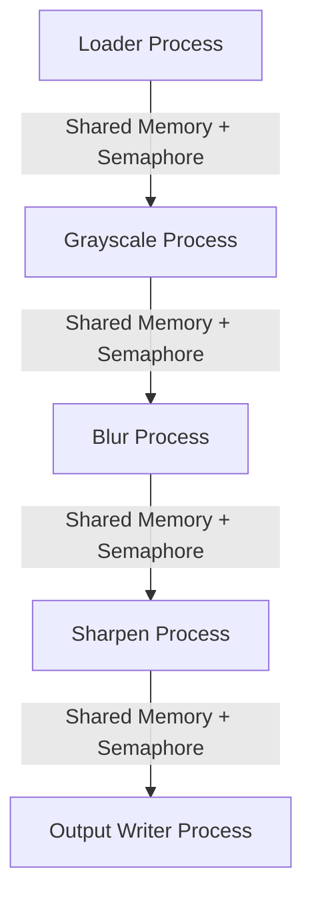

# Introduction

This project aims to implement a simplified **operating-system-style image processing pipeline** using the C language on a Linux platform.
Each image filter (Grayscale, Blur, Sharpen) runs as a **separate process**, while each process uses **POSIX threads** to handle different image chunks concurrently.

The system demonstrates key operating system concepts such as:

- CPU Scheduling simulation
- Process creation using `fork()` and `exec()`
- Thread management using pthreads
- Dynamic memory management
- Inter-Process Communication through Shared Memory
- Process/thread Synchronization with Semaphores & Mutex Locks

# Problem Statement

Modern operating systems use concurrent processes and threads to speed up multimedia operations.
This project simulates that behavior by creating an image-processing pipeline where each stage is isolated in its own process and communicates via shared memory with proper synchronization.

# Objectives

- Process images using a pipeline architecture similar to UNIX utilities.
- Demonstrate OS-level concurrency: processes + threads + IPC.
- Implement safe shared memory communication using semaphores/mutexes.
- Simulate CPU scheduling policies inside processing routines.

# Methodology

## 1. Process Architecture

The program will create **five processes**:

1. Loader Process
2. Grayscale Filter Process
3. Blur Filter Process
4. Sharpen Filter Process
5. Output Writer Process

Each process will be created using `fork()`, while filter processes may replace themselves using `exec()` for modularity.

## 2. Threading Structure

Each process will internally create multiple **pthread worker threads**, each responsible for processing a block of the image.

Example:

- If image has 8 blocks then 8 worker threads per filter.

## 3. Memory Management

- Image buffers will be dynamically allocated using `malloc()`.
- Each filter will allocate its own chunk buffers.
- Memory will be properly freed to avoid leaks.

## 4. Inter-Process Communication (IPC)

**Shared Memory (shmget, shmat)** will be used to exchange image chunks between processes.

- **Loader**: writes raw image to SHM
- **Filters**: read and write processed image blocks
- **Writer**: reads final output from SHM

## 5. Synchronization

- **Semaphores** to signal "data ready" between processes.
- **Mutexes** to protect shared memory from race conditions.

## 6. CPU Scheduling Simulation

- **Round Robin (RR)** time slices between filter threads
- **Priority Scheduling:** heavy filters (e.g., Sharpen) get higher priority
- **Artificial delay** using `usleep()` to simulate scheduling quantum

# Scope

- Multi-process pipeline
- Thread-level concurrency
- Shared memory communication
- Synchronization primitives
- CPU scheduling simulation
- Multiple image filters

# System Architecture Diagram

# Expected Outcomes

- Fully functional OS-style pipeline with concurrency.
- Clean, modular C code demonstrating deep OS understanding.
- Clear demonstration of:

  - fork/exec
  - pthreads
  - shared memory
  - semaphores
  - memory management
  - scheduling policies
