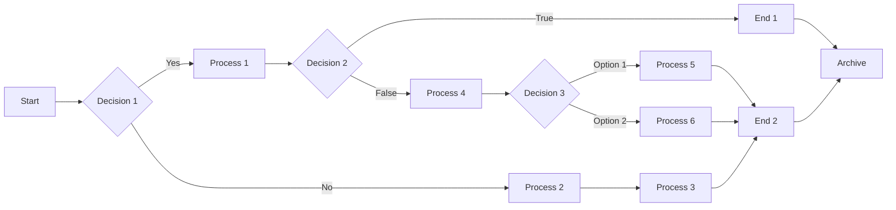

# Markdown to LaTeX Comprehensive Guide

- ✅ **Standard Markdown Support**: Headings, lists, tables, links, images, blockquotes, and more.
- 📝 **Text Formatting**: Bold, italic, underline, strikethrough, highlight, superscript, subscript, small caps.
- 💻 **Code Blocks**: Syntax highlighting, inline code, executable Python code with output/plots.
- 📊 **Diagrams**: Mermaid diagrams for flowcharts and graphs.
- 📋 **Task Lists**: Checkboxes for to-do and progress tracking.
- 🦶 **Footnotes**: Inline and reference footnotes.
- 🧮 **Math**: Inline and display math with LaTeX syntax.
- 🏷️ **Definition Lists**: Term-definition pairs.
- 📑 **Tables**: Pipe tables, captions, and alignment.
- ⚠️ **Alerts \& Containers**: Note, tip, important, warning, caution, box, and alignment containers.
- 🎨 **Custom Extensions**: Center/right alignment, keyboard shortcuts, line breaks, and more.
- 🏷️ **Metadata \& Variables**: JSON metadata, document variables, and title page templates.
- 🌐 **Emoji Support**: Use emojis anywhere in your markdown for expressive documents! 😃

# Basic and Advanced Syntax

## Headings

```markdown
# Heading 1

## Heading 2

### Heading 3

#### Heading 4

##### Heading 5

###### Heading 6
```

# Heading 1

## Heading 2

### Heading 3

#### Heading 4

##### Heading 5

###### Heading 6

## Text Formatting

### Bold

```markdown
**bold text** or __bold text__
```

**bold text** or __bold text__

### Italic

```markdown
_italic text_ or *italic text*
```

_italic text_ or *italic text*

### Bold + Italic

```markdown
**_bold and italic_** or ***bold and italic***
```

**_bold and italic_** or ***bold and italic***

### Strikethrough

```markdown
~~strikethrough text~~
```

~~strikethrough text~~

### Highlight

```markdown
==highlighted text==
```

==highlighted text==

### Superscript

```markdown
^superscript^ (e.g., x^2^)
```

^superscript^ (e.g., x^2^)

### Subscript

```markdown
~subscript~ (e.g., H~2~O)
```

~subscript~ (e.g., H~2~O)

### Small Caps

```markdown
^^Small Caps Text^^
```

^^Small Caps Text^^

### Underline

```markdown
--Underlined Text--
```

--Underlined Text--

## Inline Code

```markdown
`inline code`
```

`inline code`

## Code Blocks

### Code Block Without Language

````markdown
```
plain text code block
```
````

```
plain text code block
```

### Code Block With Language

#### Example 1

````markdown
```python
def hello():
    print("Hello, World!")
```
````

```python
def hello():
    print("Hello, World!")
```

#### Example 2

````markdown
```console
$ command
output result
```
````

```console
$ command
output result
```

::: note
For highlighting specific lines in code blocks or making them executable, refer to the **Executable Code Blocks** section below.
:::

## Links

### Basic Link

```markdown
[link text](https://example.com?query=1&value=2)
```

[link text](https://example.com?query=1&value=2)

### Link with Title

```markdown
[link text](https://example.com "title")
```

[link text](https://example.com "title")

## Images

### Basic Image

```markdown

```


### Image with Title

```markdown

```


### Image from URL

```markdown

```


## Mermaid Diagrams

````markdown

````


## Lists

### Unordered List

```markdown
- Item 1
- Item 2
  - Nested item 2.1
  - Nested item 2.2
- Item 3
```

- Item 1
- Item 2
  - Nested item 2.1
  - Nested item 2.2
- Item 3

### Ordered List

```markdown
1. First item
2. Second item
   1. Nested item 2.1
   2. Nested item 2.2
3. Third item
```

1. First item
2. Second item
   1. Nested item 2.1
   2. Nested item 2.2
3. Third item

### Task Lists

```markdown
- [x] Completed task
- [ ] Incomplete task
- [/] Partially completed task
```

- [x] Completed task
- [ ] Incomplete task
- [/] Partially completed task

## Definition Lists

```markdown
Term 1
: Definition 1

Term 2
: Definition 2a
: Definition 2b
```

Term 1
: Definition 1

Term 2
: Definition 2a
: Definition 2b

## Tables

### Table without Caption

```markdown
| Left | Center | Right | Default |
| :--- | :----: | ----: | ------- |
| L1   |   C1   |    R1 | Default |
| L2   |   C2   |    R2 | Default |
```

| Left | Center | Right | Default |
| :--- | :----: | ----: | ------- |
| L1   |   C1   |    R1 | Default |
| L2   |   C2   |    R2 | Default |

### Table with Captions

```markdown
| Header 1 | Header 2 | Header 3 |
| -------- | -------- | -------- |
| Cell 1   | Cell 2   | Cell 3   |
| Cell 4   | Cell 5   | Cell 6   |

: Sample Table with Caption
```

| Header 1 | Header 2 | Header 3 |
| -------- | -------- | -------- |
| Cell 1   | Cell 2   | Cell 3   |
| Cell 4   | Cell 5   | Cell 6   |

: Sample Table with Caption

## Horizontal Rule

```markdown
___
```

___

```markdown
***
```

***

```markdown
---
```

---

## Math Expressions

### Inline Math

```markdown
This is inline math: $E = mc^2$
```

This is inline math: $E = mc^2$

### Display Math

```markdown
$$
\int_{0}^{\infty} e^{-x^2} dx = \frac{\sqrt{\pi}}{2}
$$
```

$$
\int_{0}^{\infty} e^{-x^2} dx = \frac{\sqrt{\pi}}{2}
$$

## Footnotes

### Inline Footnote

```markdown
Text with inline footnote^[This is the footnote content].
```

Text with inline footnote^[This is the footnote content].

### Reference Footnote

```markdown
Text with reference footnote[^1].

[^1]: This is the footnote content.
```

Text with reference footnote[^1].

[^1]: This is the footnote content.

## Keyboard Shortcuts

### Single Key

```markdown
[[Ctrl]]
```

[[Ctrl]]

### Key Combination with Plus

```markdown
[[Ctrl] + [C]]
```

[[Ctrl] + [C]]

## Line Break

### Using Two Spaces

Put two spaces at the end of a line 1 to create a line break.

```markdown
Line 1<space><space>
Line 2
```

Line 1  
Line 2

### Using Backslash

```markdown
Line 1\
Line 2
```

Line 1\
Line 2

### Using HTML `<br>` Tag

```markdown
Line 1<br>
Line 2
```

Line 1<br>
Line 2

```markdown
Line 1<br/>
Line 2
```

Line 1<br/>
Line 2

### Using Empty Line (Paragraph Break)

```markdown
Line 1

Line 2
```

Line 1

Line 2

## Blockquotes

### Basic Blockquote

```markdown
> This is a blockquote.
```

> This is a blockquote.

### Multi-line Blockquote

```markdown
> This is a blockquote.
> It can span multiple lines.
>
> And multiple paragraphs.
```

> This is a blockquote.
> It can span multiple lines.
>
> And multiple paragraphs.

### Nested Blockquotes

```markdown
> Level 1
>
> > Level 2
> >
> > > Level 3
```

> Level 1
>
> > Level 2
> >
> > > Level 3

## Container Alerts

### Note Alert

```markdown
::: note
This is a note alert with blue styling.
:::
```

::: note
This is a note alert with blue styling.
:::

### Tip Alert

```markdown
::: tip
This is a tip alert with green styling.
:::
```

::: tip
This is a tip alert with green styling.
:::

### Important Alert

```markdown
::: important
This is an important alert with purple styling.
:::
```

::: important
This is an important alert with purple styling.
:::

### Warning Alert

```markdown
::: warning
This is a warning alert with yellow/orange styling.
:::
```

::: warning
This is a warning alert with yellow/orange styling.
:::

### Caution Alert

```markdown
::: caution
This is a caution alert with red styling.
:::
```

::: caution
This is a caution alert with red styling.
:::

## Text Alignment Containers

### Center Alignment

```markdown
::: center
This text is centered
:::
```

::: center
This text is centered
:::

### Right Alignment

```markdown
::: right
Right-aligned text
:::
```

::: right
Right-aligned text
:::

## Box Container

### Basic Box

```markdown
::: box
Text in a bordered box
:::
```

::: box
Text in a bordered box
:::

## Executable Code Blocks

The converter supports executing code blocks in various languages directly within your markdown and including their output or generated plots in the final PDF.

### Supported Languages

- `python`
- `javascript`
- `powershell`
- `bash`

### Properties

- `.execute`: Execute the code block
- `.show-code`: Display the source code in the output
- `.show-output`: Display execution output/plot (default)
- `.hide-code`: Explicitly hide the source code (default)
- `.hide-output`: Hide execution output/plot
- `.cache`: Cache the execution output (default)
- `.no-cache`: Do not use cache and force re-execution
- `.highlightlines`: Highlight specific lines in the code block

### Example 1: Python with Output

````markdown
```python {.execute .show-code .highlightlines=2,4-6}
print("Line 1")
print("Line 2")
print("Line 3")
print("Line 4")
print("Line 5")
print("Line 6")
```
````

```python {.execute .show-code .highlightlines=2,4-6}
print("Line 1")
print("Line 2")
print("Line 3")
print("Line 4")
print("Line 5")
print("Line 6")
```

### Example 2: JavaScript Execution

````markdown
```javascript {.execute .show-code}
const a = 5;
const b = 10;
console.log(`The sum of ${a} and ${b} is ${a + b}.`);
```
````

```javascript {.execute .show-code}
const a = 5;
const b = 10;
console.log(`The sum of ${a} and ${b} is ${a + b}.`);
```

### Example 3: Python Plotting

::: note
The following example generates a polar plot using matplotlib. Install the required packages if you haven't already.

```powershell
python -m pip install matplotlib numpy
```
:::

````markdown
```python {.execute}
import numpy as np
import matplotlib.pyplot as plt

r = np.arange(0, 2, 0.01)
theta = 2 * np.pi * r
fig, ax = plt.subplots(
  subplot_kw = {'projection': 'polar'}
)
ax.plot(theta, r)
ax.set_rticks([0.5, 1, 1.5, 2])
ax.grid(True)
plt.show()
```
````

```python {.execute}
import numpy as np
import matplotlib.pyplot as plt

r = np.arange(0, 2, 0.01)
theta = 2 * np.pi * r
fig, ax = plt.subplots(
  subplot_kw = {'projection': 'polar'}
)
ax.plot(theta, r)
ax.set_rticks([0.5, 1, 1.5, 2])
ax.grid(True)
plt.show()
```

# Document Metadata (JSON)

Document metadata is configured in a separate JSON file:

```json
{
  "title": "Document Title",
  "subtitle": "Course Name",
  "submittedto": "Professor Name",
  "university": "University Name",
  "department": "Department Name",
  "date": "January 1, 2024",
  "submittedby": [
    {
      "name": "Student Name",
      "roll": "Registration Number"
    }
  ],
  "variables": {},
  "titleTemplate": 0,
  "enableContentPage": false,
  "tocDepth": 3,
  "enablePageCredits": false,
  "moveFootnotesToEnd": false,
  "footnotesAsComments": false,
  "enableThatsAllPage": false,
  "headingNumbering": true
}
```

## Settings

- `title`: Document title
- `subtitle`: Document subtitle
- `submittedto`: Name of the person to whom the document is submitted
- `university`: Name of the university or institution
- `department`: Name of the department
- `date`: Date of submission
- `submittedby`: List of submitters with their names and registration numbers
- `variables`: Define custom variables to use throughout the document. See below
- `titleTemplate`: Controls the style of the title page. Options include:
  - `0`: No title (disabled) - Default
  - `1`: Full university title page with logo - Good for assignments and reports
  - `2`: Title header above content - Good for notes
  - `3`: Title on separate page - Good for when the contents are enabled
- `enableContentPage`: Set to `true` to include a table of contents page
- `tocDepth`: Set the depth of the table of contents (1-6)
- `enablePageCredits`: Set to `true` to include credits
- `moveFootnotesToEnd`: Set to `true` to move all footnotes to the end of the document
- `footnotesAsComments`: Set to `true` to render footnotes as comments
- `enableThatsAllPage`: Set to `true` to include a "That's All" page at the end of the document
- `headingNumbering`: Set to `true` to enable automatic numbering of headings

### `variables` Usage

You can define variables in the JSON metadata file and use them throughout your markdown document. Variables are defined under the `"variables"` key and referenced using `{{variable_name}}` syntax.

Example JSON with variables:

```json
{
  "variables": {
    "author": "abd",
    "version": "1.2.3",
    "course": "CS 101",
    "semester": "Fall 2025",
    "university_full": "University of Engineering and Technology"
  }
}
```

```markdown
This report was written by {{author}} for {{course}} during {{semester}}.

Software version: {{version}}

Institution: {{university_full}}
```

This report was written by abd for CS 101 during Fall 2025.

Software version: 1.2.3

Institution: University of Engineering and Technology
