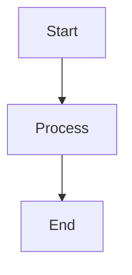

# Markdown to LaTeX Comprehensive Guide

This guide demonstrates all supported markdown syntax features for the md-to-luatex converter.

## Headings

```markdown
# Heading 1

## Heading 2

### Heading 3

#### Heading 4

##### Heading 5

###### Heading 6
```

# Heading 1

## Heading 2

### Heading 3

#### Heading 4

##### Heading 5

###### Heading 6

## Text Formatting

### Bold

```markdown
**bold text** or __bold text__
```

**bold text** or __bold text__

### Italic

```markdown
_italic text_ or *italic text*
```

_italic text_ or *italic text*

### Bold + Italic

```markdown
**_bold and italic_** or ***bold and italic***
```

**_bold and italic_** or ***bold and italic***

### Strikethrough

```markdown
~~strikethrough text~~
```

~~strikethrough text~~

### Highlight

```markdown
==highlighted text==
```

==highlighted text==

### Superscript

```markdown
^superscript^ (e.g., x^2^)
```

^superscript^ (e.g., x^2^)

### Subscript

```markdown
~subscript~ (e.g., H~2~O)
```

~subscript~ (e.g., H~2~O)

## Inline Code

```markdown
`inline code`
```

`inline code`

## Code Blocks

### Fenced Code Block

````markdown
```python
def hello():
    print("Hello, World!")
```
````

```python
def hello():
    print("Hello, World!")
```

### Code Block Without Language

````markdown
```
plain text code block
```
````

```
plain text code block
```

### Terminal Block

````markdown
```terminal
$ command
output result
```
````

```terminal
$ command
output result
```

## Links

```markdown
[link text](https://example.com)
```

[link text](https://example.com)

```markdown
[link text](https://example.com "title")
```

[link text](https://example.com "title")

## Images

```markdown

```


```markdown

```


## Mermaid Diagrams

````markdown

````


## Lists

### Unordered List

```markdown
- Item 1
- Item 2
  - Nested item 2.1
  - Nested item 2.2
- Item 3
```

- Item 1
- Item 2
  - Nested item 2.1
  - Nested item 2.2
- Item 3

### Ordered List

```markdown
1. First item
2. Second item
   1. Nested item 2.1
   2. Nested item 2.2
3. Third item
```

1. First item
2. Second item
   1. Nested item 2.1
   2. Nested item 2.2
3. Third item

### Task Lists

```markdown
- [x] Completed task
- [ ] Incomplete task
- [/] Partially completed task
```

- [x] Completed task
- [ ] Incomplete task
- [/] Partially completed task

## Definition Lists

```markdown
Term 1
: Definition 1

Term 2
: Definition 2a
: Definition 2b
```

Term 1
: Definition 1

Term 2
: Definition 2a
: Definition 2b

## Tables

### Pipe Tables

```markdown
| Left | Center | Right | Default |
| :--- | :----: | ----: | ------- |
| L1   |   C1   |    R1 | Default |
| L2   |   C2   |    R2 | Default |
```

| Left | Center | Right | Default |
| :--- | :----: | ----: | ------- |
| L1   |   C1   |    R1 | Default |
| L2   |   C2   |    R2 | Default |

## Table with Captions

```markdown
| Header 1 | Header 2 | Header 3 |
| -------- | -------- | -------- |
| Cell 1   | Cell 2   | Cell 3   |
| Cell 4   | Cell 5   | Cell 6   |

: Sample Table with Caption
```

| Header 1 | Header 2 | Header 3 |
| -------- | -------- | -------- |
| Cell 1   | Cell 2   | Cell 3   |
| Cell 4   | Cell 5   | Cell 6   |

: Sample Table with Caption

## Horizontal Rule

```markdown
---
```

---

```markdown
___
```

___

```markdown
***
```

***

## Math Expressions

### Inline Math

```markdown
This is inline math: $E = mc^2$
```

This is inline math: $E = mc^2$

### Display Math

```markdown
$$
\int_{0}^{\infty} e^{-x^2} dx = \frac{\sqrt{\pi}}{2}
$$
```

$$
\int_{0}^{\infty} e^{-x^2} dx = \frac{\sqrt{\pi}}{2}
$$

## Footnotes

### Inline Footnote

```markdown
Text with inline footnote^[This is the footnote content].
```

Text with inline footnote^[This is the footnote content].

### Reference Footnote

```markdown
Text with reference footnote[^1].

[^1]: This is the footnote content.
```

Text with reference footnote[^1].

[^1]: This is the footnote content.

## Keyboard Shortcuts

### Single Key

```markdown
[[Ctrl]]
```

[[Ctrl]]

### Key Combination with Plus

```markdown
[[Ctrl] + [C]]
```

[[Ctrl] + [C]]

## Line Break

### Using Two Spaces

Put two spaces at the end of a line 1 to create a line break.

```markdown
Line 1<space><space>
Line 2
```

Line 1  
Line 2

### Using Backslash

```markdown
Line 1\
Line 2
```

Line 1\
Line 2

### Using HTML `<br>` Tag

```markdown
Line 1<br>
Line 2
```

Line 1<br>
Line 2

```markdown
Line 1<br/>
Line 2
```

Line 1<br/>
Line 2

### Using Empty Line (Paragraph Break)

```markdown
Line 1


Line 2
```

Line 1


Line 2

## Blockquotes

```markdown
> This is a blockquote.
> It can span multiple lines.
>
> And multiple paragraphs.
```

> This is a blockquote.
> It can span multiple lines.
>
> And multiple paragraphs.

### Nested Blockquotes

```markdown
> Level 1
>
> > Level 2
> >
> > > Level 3
```

> Level 1
>
> > Level 2
> >
> > > Level 3

### Blockquotes with Styled Content

Blockquotes can contain inline code, keyboard shortcuts, tables, and other formatted elements:

```markdown
> This blockquote contains `inline code` and keyboard shortcuts like [[Ctrl] + [C]].
>
> It can also have **bold**, _italic_, and ==highlighted== text.
>
> | Feature | Supported |
> | ------- | --------- |
> | Tables  | Yes       |
> | Code    | Yes       |
```

> This blockquote contains `inline code` and keyboard shortcuts like [[Ctrl] + [C]].
>
> It can also have **bold**, _italic_, and ==highlighted== text.
>
> | Feature | Supported |
> | ------- | --------- |
> | Tables  | Yes       |
> | Code    | Yes       |

### Blockquotes with Code Blocks

````markdown
> Here's a code example inside a blockquote:
>
> ```python
> def greet(name):
>     return f"Hello, {name}!"
> ```
>
> The code block maintains its syntax highlighting.
````

> Here's a code example inside a blockquote:
>
> ```python
> def greet(name):
>     return f"Hello, {name}!"
> ```
>
> The code block maintains its syntax highlighting.

## GitHub Alerts

### Note Alert

```markdown
> [!NOTE]
> This is a note alert with blue styling.
```

> [!NOTE]
> This is a note alert with blue styling.

### Tip Alert

```markdown
> [!TIP]
> This is a tip alert with green styling.
```

> [!TIP]
> This is a tip alert with green styling.

### Important Alert

```markdown
> [!IMPORTANT]
> This is an important alert with purple styling.
```

> [!IMPORTANT]
> This is an important alert with purple styling.

### Warning Alert

```markdown
> [!WARNING]
> This is a warning alert with yellow/orange styling.
```

> [!WARNING]
> This is a warning alert with yellow/orange styling.

### Caution Alert

```markdown
> [!CAUTION]
> This is a caution alert with red styling.
```

> [!CAUTION]
> This is a caution alert with red styling.

### Alerts with Rich Content

GitHub alerts can also contain formatted text, code, tables, and keyboard shortcuts:

```markdown
> [!TIP]
> **Pro Tip:** Use `git commit -m "message"` to commit changes.
>
> Common keyboard shortcuts:
>
> - Save: [[Ctrl] + [S]]
> - Undo: [[Ctrl] + [Z]]
>
> | Command      | Description             |
> | ------------ | ----------------------- |
> | `git status` | Check repository status |
> | `git log`    | View commit history     |
```

> [!TIP]
> **Pro Tip:** Use `git commit -m "message"` to commit changes.
>
> Common keyboard shortcuts:
>
> - Save: [[Ctrl] + [S]]
> - Undo: [[Ctrl] + [Z]]
>
> | Command      | Description             |
> | ------------ | ----------------------- |
> | `git status` | Check repository status |
> | `git log`    | View commit history     |

````markdown
> [!WARNING]
> This contains ==highlighted text==, ~~strikethrough~~, and ^superscript^!
>
> Code example:
>
> ```bash
> rm -rf /
> ```
>
> **Never** run the above command!
````

> [!WARNING]
> This contains ==highlighted text==, ~~strikethrough~~, and ^superscript^!
>
> Code example:
>
> ```bash
> rm -rf /
> ```
>
> **Never** run the above command!

---

## Executable Python Code Blocks

The converter supports executing Python code blocks directly within your markdown and including their output or generated plots in the final PDF.

### Prerequisites

For Python code execution to work, you need Python installed on your system. To generate plots with matplotlib, install the required packages:

```powershell
python -m pip install matplotlib numpy
```

> [!NOTE]
> Mermaid diagram support is already documented in the [Mermaid Diagrams](#mermaid-diagrams) section and requires separate installation of `@mermaid-js/mermaid-cli` via npm.

### Basic Syntax

Mark a Python code block for execution using properties in curly braces:

````markdown
```python {.execute}
print("Hello, World!")
```
````

### Available Properties

- **`.execute`** - Execute the code block (required)
- **`.show-code`** - Display the source code in the output
- **`.show-output`** - Display execution output/plot (enabled by default)
- **`.hide-code`** - Explicitly hide the source code (default)
- **`.hide-output`** - Hide execution output/plot

### Simple Print Example

**Output only** (default):

````markdown
```python {.execute}
print("Hello, World!")
```
````

```python {.execute}
print("Hello, World!")
```

**Show both code and output**:

````markdown
```python {.execute .show-code}
print("Hello, World!")
```
````

```python {.execute .show-code}
print("Hello, World!")
```

### Matplotlib Plots

When your code uses matplotlib, the plot is automatically saved as a PDF and embedded in the document.

**Simple plot example (plot only):**

````markdown
```python {.execute}
import numpy as np
import matplotlib.pyplot as plt

x = np.linspace(0, 2 * np.pi, 100)
y = np.sin(x)

plt.figure(figsize=(8, 4))
plt.plot(x, y)
plt.title('Sine Wave')
plt.xlabel('x')
plt.ylabel('sin(x)')
plt.grid(True)
plt.show()
```
````

```python {.execute}
import numpy as np
import matplotlib.pyplot as plt

x = np.linspace(0, 2 * np.pi, 100)
y = np.sin(x)

plt.figure(figsize=(8, 4))
plt.plot(x, y)
plt.title('Sine Wave')
plt.xlabel('x')
plt.ylabel('sin(x)')
plt.grid(True)
plt.show()
```

**Polar plot with code shown:**

````markdown
```python {.execute .show-code}
import numpy as np
import matplotlib.pyplot as plt

r = np.arange(0, 2, 0.01)
theta = 2 * np.pi * r
fig, ax = plt.subplots(
  subplot_kw = {'projection': 'polar'}
)
ax.plot(theta, r)
ax.set_rticks([0.5, 1, 1.5, 2])
ax.grid(True)
plt.show()
```
````

```python {.execute .show-code}
import numpy as np
import matplotlib.pyplot as plt

r = np.arange(0, 2, 0.01)
theta = 2 * np.pi * r
fig, ax = plt.subplots(
  subplot_kw = {'projection': 'polar'}
)
ax.plot(theta, r)
ax.set_rticks([0.5, 1, 1.5, 2])
ax.grid(True)
plt.show()
```

**Multiple subplots:**

````markdown
```python {.execute}
import numpy as np
import matplotlib.pyplot as plt

fig, axes = plt.subplots(2, 2, figsize=(10, 8))
x = np.linspace(0, 2 * np.pi, 100)

axes[0, 0].plot(x, np.sin(x))
axes[0, 0].set_title('Sine')

axes[0, 1].plot(x, np.cos(x))
axes[0, 1].set_title('Cosine')

axes[1, 0].plot(x, np.tan(x))
axes[1, 0].set_title('Tangent')
axes[1, 0].set_ylim(-10, 10)

axes[1, 1].plot(x, np.exp(-x/3) * np.sin(x))
axes[1, 1].set_title('Damped Sine')

plt.tight_layout()
plt.show()
```
````

```python {.execute}
import numpy as np
import matplotlib.pyplot as plt

fig, axes = plt.subplots(2, 2, figsize=(10, 8))
x = np.linspace(0, 2 * np.pi, 100)

axes[0, 0].plot(x, np.sin(x))
axes[0, 0].set_title('Sine')

axes[0, 1].plot(x, np.cos(x))
axes[0, 1].set_title('Cosine')

axes[1, 0].plot(x, np.tan(x))
axes[1, 0].set_title('Tangent')
axes[1, 0].set_ylim(-10, 10)

axes[1, 1].plot(x, np.exp(-x/3) * np.sin(x))
axes[1, 1].set_title('Damped Sine')

plt.tight_layout()
plt.show()
```

## Document Metadata (JSON)

Document metadata is configured in a separate JSON file:

```json
{
  "title": "Document Title",
  "subtitle": "Course Name",
  "submittedto": "Professor Name",
  "university": "University Name",
  "department": "Department Name",
  "date": "January 1, 2024",
  "submittedby": [
    {
      "name": "Student Name",
      "roll": "Registration Number"
    }
  ],
  "titleTemplate": 1,
  "enableContentPage": false,
  "enablePageCredits": false,
  "moveFootnotesToEnd": false,
  "enableThatsAllPage": true
}
```

### Title Template Modes

The `titleTemplate` setting controls how the title page is displayed:

- **`0`**: No title (disabled)
- **`1`**: Full university title page with logo (default) - Good for assignments and reports
- **`2`**: Title header above content - Good for notes
- **`3`**: Title on separate page - Good for when the contents are enabled

Controls document structure, metadata, and optional pages.
